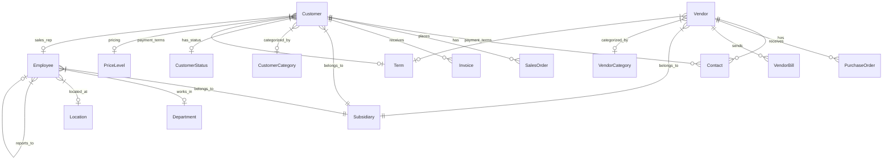
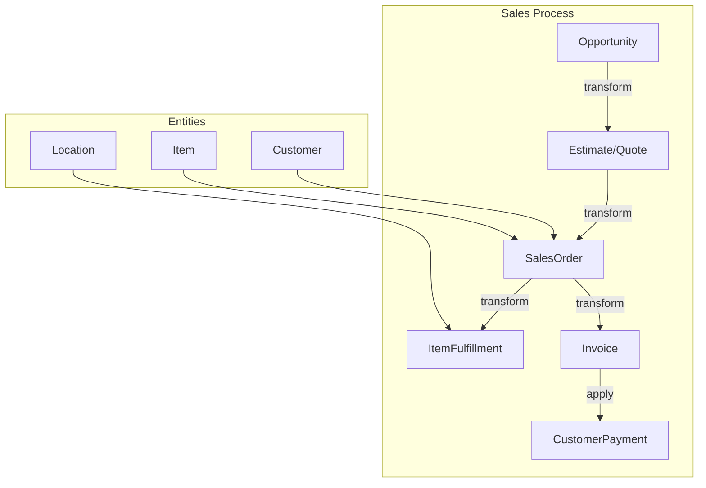
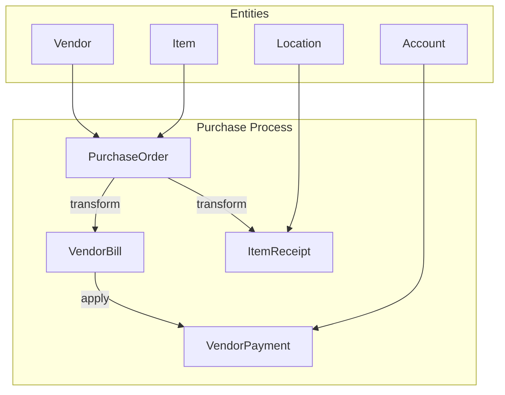
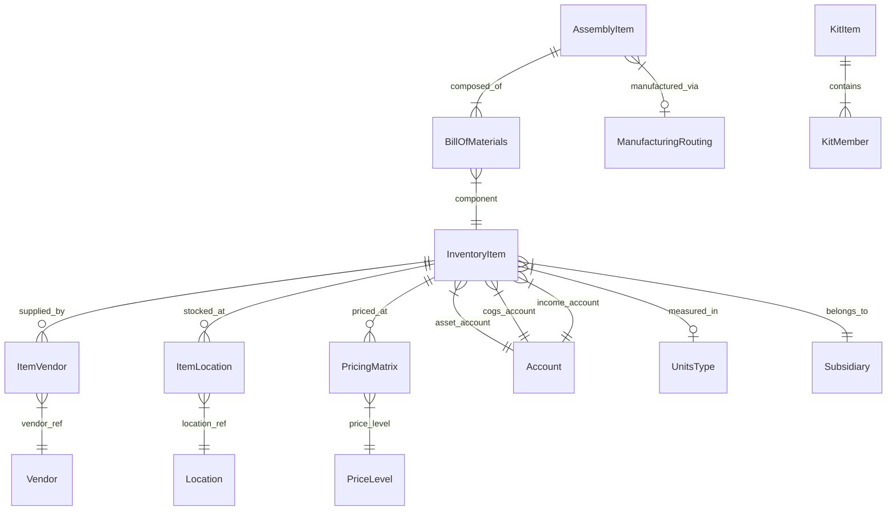
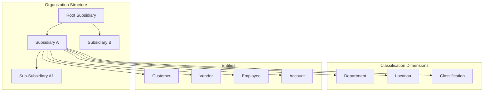
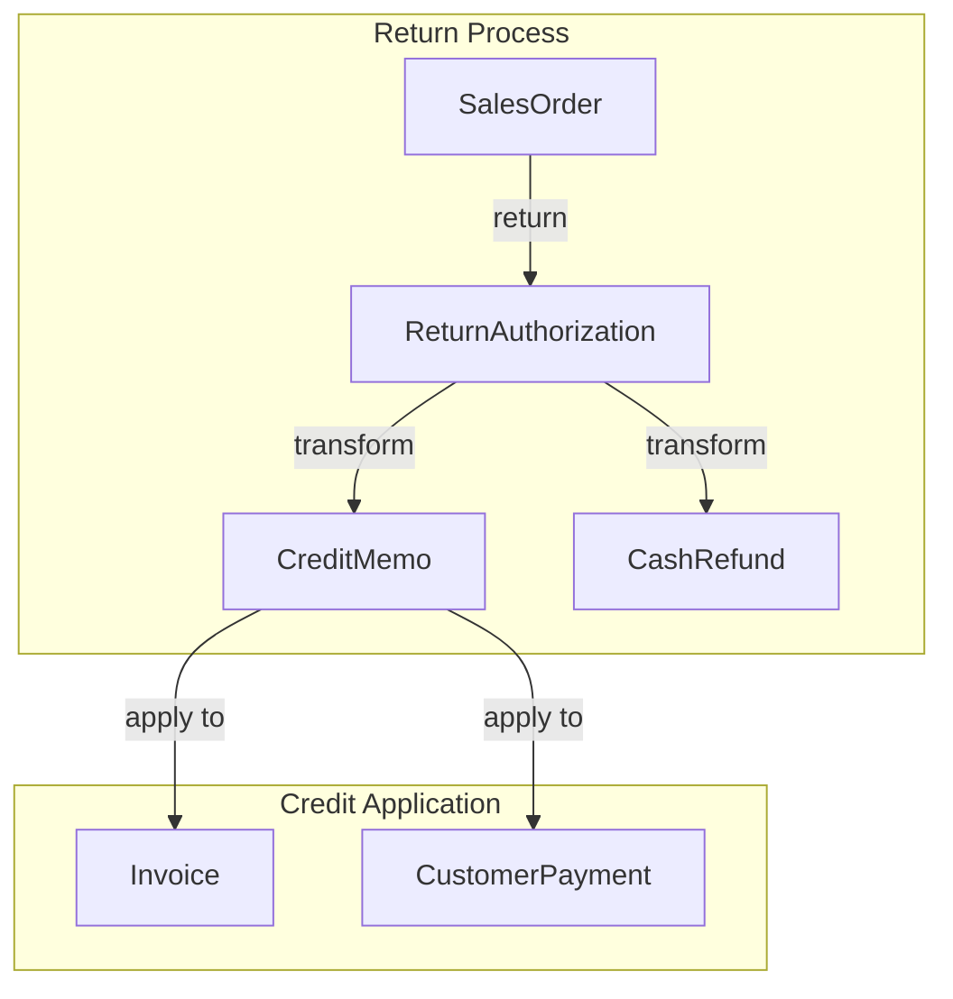
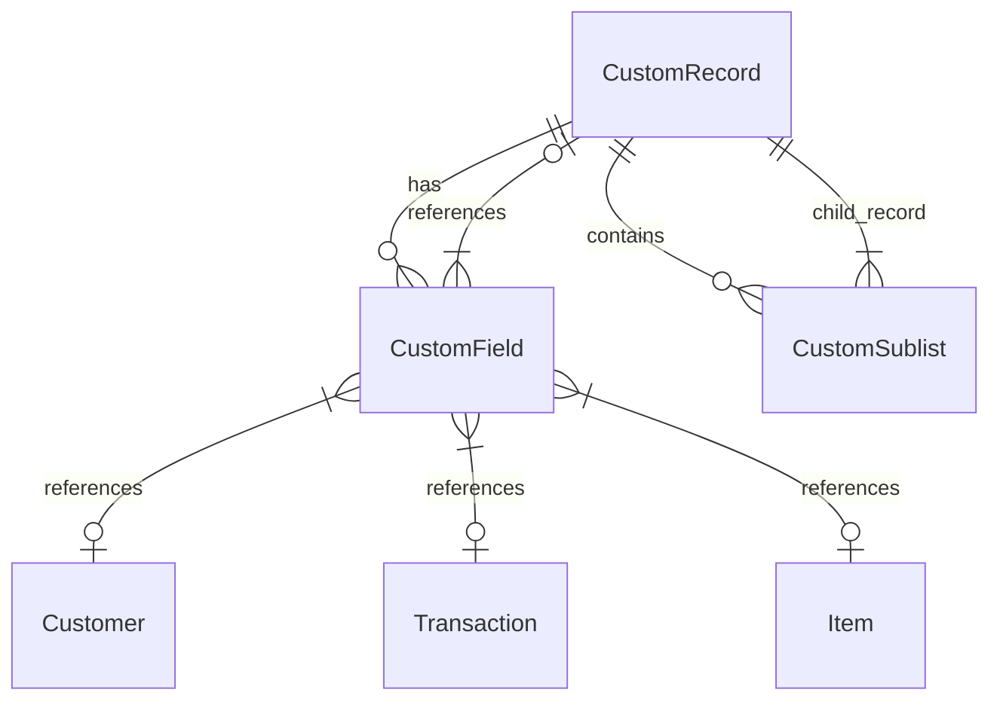
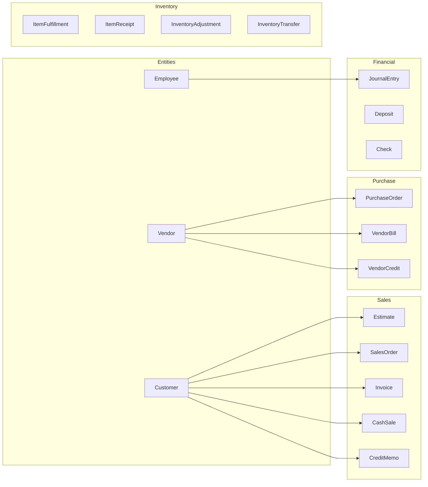

# NetSuite Entity Relationship Diagrams

This document contains Mermaid diagrams showing the relationships between key NetSuite objects.

## 1. Core Entity Relationships



## 2. Sales Order Flow



## 3. Purchase Order Flow



## 4. Item Hierarchy



## 5. Organizational Structure (OneWorld)



## 6. Transaction Line Items

```mermaid
erDiagram
    Transaction ||--|{ TransactionLine : contains
    TransactionLine }|--|| Item : references
    TransactionLine }|--o| Location : at_location
    TransactionLine }|--o| Department : in_department
    TransactionLine }|--o| Class : classified_as
    TransactionLine }|--o| TaxCode : taxed_by

    Transaction }|--|| Subsidiary : belongs_to
    Transaction }|--o| Customer : for_customer
    Transaction }|--o| Vendor : from_vendor
    Transaction }|--|| Currency : in_currency
```

## 7. Accounting Relationships

```mermaid
erDiagram
    JournalEntry ||--|{ JournalEntryLine : contains
    JournalEntryLine }|--|| Account : debits_credits
    JournalEntryLine }|--o| Department : in_department
    JournalEntryLine }|--o| Location : at_location
    JournalEntryLine }|--o| Class : classified_as
    JournalEntryLine }|--o| Customer : for_customer
    JournalEntryLine }|--o| Vendor : from_vendor

    Account }|--o| Account : parent_account
    Account }|--|| Subsidiary : belongs_to
    Account }|--o| Currency : in_currency

    JournalEntry }|--|| Subsidiary : belongs_to
    JournalEntry }|--|| Currency : in_currency
```

## 8. Return and Credit Flow



## 9. Custom Record Relationships



## 10. Complete Transaction Entity Map


